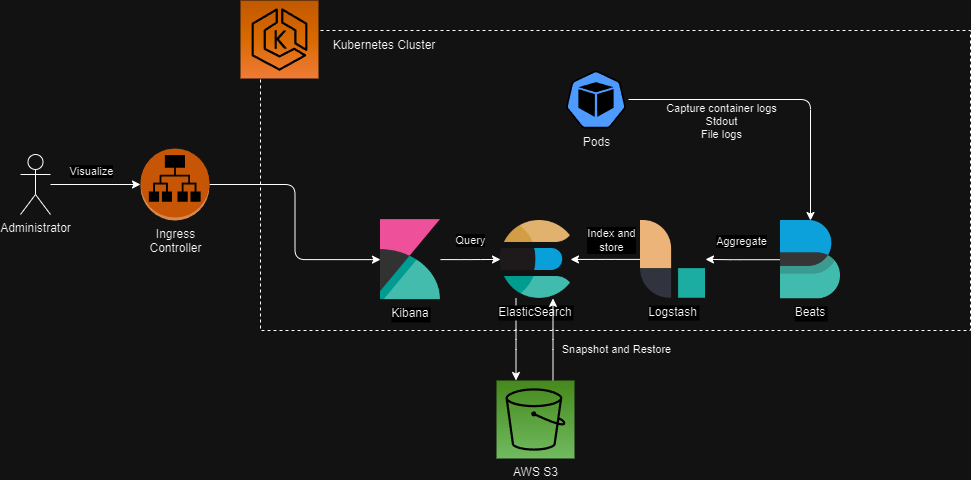

# Log Aggregator for Kubernetes
This project sets up the ELK stack in a Kubernetes cluster and stores snapshots on Amazon S3 with ElasticSearch.

## Table of Contents
- [Log Aggregator for Kubernetes](#log-aggregator-for-kubernetes)
  - [Table of Contents](#table-of-contents)
  - [Architecture](#architecture)
  - [Technologies](#technologies)
  - [Features](#features)
  - [Getting Started](#getting-started)
    - [Prerequisites](#prerequisites)
    - [Installing (development only)](#installing-development-only)
  - [Setup](#setup)
    - [Development](#development)
    - [Production](#production)
      - [Running Terraform](#running-terraform)
      - [Integrating with Amazon S3 Snapshot and Restore](#integrating-with-amazon-s3-snapshot-and-restore)
  - [Work-in-progress](#work-in-progress)
  - [Authors](#authors)
  - [License](#license)

## Architecture


## Technologies
- FileBeat - FileBeat collects logs from containers and sends them to Logstash
- Logstash - Collects logs from various sources and sends them to ElasticSearch to be indexed
- ElasticSearch - Indexes logs in a storage system and allows them to be queried
- Kibana - Allows the user to query ElasticSearch data and visualize the results
- Amazon S3 - Amazon Web Services Object Storage service

## Features
- Stdout and file log collection from containers with FileBeat
- Amazon S3 Snapshot and Restore
- Data querying
- Data visualization

## Getting Started
This step describes the prerequisites and steps for setting up the ELK stack in Kubernetes both locally and on AWS EKS.

### Prerequisites
- Microk8s, minikube or another local Kubernetes provider with Kubectl (for local development)
- Amazon Web Services account

### Installing (development only)
First install any Kubernetes local cluster manager. The following example shows how to install Microk8s:
```sh
sudo snap install microk8s --classic
```

Then, download and install Kubectl:
```sh
curl -LO "https://dl.k8s.io/release/$(curl -L -s https://dl.k8s.io/release/stable.txt)/bin/linux/amd64/kubectl"
curl -LO "https://dl.k8s.io/release/$(curl -L -s https://dl.k8s.io/release/stable.txt)/bin/linux/amd64/kubectl.sha256"
echo "$(cat kubectl.sha256)  kubectl" | sha256sum --check
sudo install -o root -g root -m 0755 kubectl /usr/local/bin/kubectl
```

If you are using Microk8s, link the host kubectl command to the microk8s cluster:
```sh
cd $HOME
mkdir .kube
cd .kube
microk8s config > config
```

Then, enable the necessary addons:
```sh
microk8s enable ingress
microk8s enable dns
microk8s enable helm
microk8s enable dashboard
microk8s enable storage
```

Now you are ready to run the ELK stack in your local cluster!

## Setup
### Development
First of all, make sure your local Kubernetes cluster is up and running. If you are using Microk8s, you can start it by running the following command:
```sh
microk8s start
```

Add the Elastic Helm repository:
```sh
helm repo add elastic https://helm.elastic.co
```

Then, deploy ElasticSearch with the development configuration:
```sh
cd elasticsearch
make  AWS_ACCESS_KEY_ID=<AWS_ACCESS_KEY_ID_WITH_S3_ACCESS> \
      AWS_SECRET_ACCESS_KEY=<AWS_SECRET_ACCESS_KEY> \
      ELASTICSEARCH_PASSWORD=<INSERT_ANY_ELASTICSEARCH_PASSWORD> \
      install-dev
cd ..
```

The next step is to dpeloy Logstash:
```sh
cd logstash
make install
cd ..
```

Now, dpeloy Filebeat:
```sh
cd filebeat
make install
cd ..
```

Before deploying Kibana, make sure the Nginx ingress controller is installed:
```sh
cd nginx
make install
cd ..
```

And lastly, deploy Kibana with the development configuration:
```sh
cd kibana
make install-dev
cd ..
```

An additional step is to port-forward ElasticSearch and Kibana services to your host machine so you can access them:
```sh
kubectl port-forward svc/elasticsearch-master 9200 --address=0.0.0.0
kubectl port-forward svc/kibana-kibana 5601 --address=0.0.0.0
```

### Production
Deployment to production to AWS can be done exclusively with Terraform. The Terraform scripts will provide the necessary infrastructure, IAM Roles and the Helm deployments of Kibana, ElasticSearch, Logstash and Filebeat. However, there are a couple necessary resources that are not deployed by the Terraform scripts, as it is assumed that the user already has these resources deployed:
- AWS Elastic Kubernetes Service cluster **without Fargate Profiles**
- Application Load Balancer Ingress Controller installed into the EKS cluster
- AWS VPC with subnets

The name of these resources must be specified as Terraform variables when deploying.

#### Running Terraform
Check the [instructions for running Terraform](./terraform/README.md) to deploy the ELK stack into your production cluster.

Once the Terraform scripts have deployed the infrastructure, the ELK stack will be ready for ingesting logs and visualizing them through Kibana.

#### Integrating with Amazon S3 Snapshot and Restore
Snapshot and Restore is an ElasticSearch feature that allows you to store snapshots of the ElasticSearch cluster in a supported storage solution for an eventual recovery. This project uses S3 as a Snapshot and Restore destination, and the instructions below will describe the steps to do so.

First of all, make sure your ELK Stack is up and running in your Kubernetes cluster. If you haven't done so, please check the previous step to deploy the ELK Stack in EKS with Terraform.

Then, access Kibana and log in with the username and password you configured and under **Management**, select **Stack Management**.

Afterwards, select the **Snapshot and Restore** under the **Data** section.

The next step is to click on **Repositories** and **Register a repository**. This should lead you to a form asking you repository name and type.

Under **Repository name**, type any repository name you wish (this is not the name of the bucket, it is the name of the ElasticSearch bucket repository, it can by any name) and under **Repository type**, select AWS S3, then press **Next**.

Under **Bucket**, paste the name of the S3 bucket created by Terraform. If you wish to send the snapshots to another bucket, make sure to tune the IAM Roles accordingly. You can specify other options such as chunk and buffer size, but these are optional.

When you are ready, head to the end of the page and **Register** the repository. You can **Verify** the connection to the bucket after doing so.

Now that the repository is registered, you must create a policy that will schedule snapshot creations. Select the **Policy** tab, give it a name, provide a name pattern (such as `<daily-snap-{now/d}>`), select the recently created repository and then set a schedule frequency.

The next steps are to fine-tune your policy, such as selecting indexes and setting TTL for your snapshots. By default, all indexes are backed up.

Done! Your first backup should start whenever the time matches with the frequency set on the Snapshot and Restore policy.

## Work-in-progress
This section describes features that are either work-in-progress or will be implemented in the future. Features are sorted by priority.

- 🚧: Work-in-progress
- ❌: Not yet started

| Feature | Status |
|---------|--------|
| Record demo video of working logging solution on EKS and S3 | ❌ |

## Authors
- Andre Wlodkovski - [@andrewlod](https://github.com/andrewlod)

## License
This project is licensed under the [MIT License](https://opensource.org/license/mit) - see the [LICENSE](LICENSE) file for details.